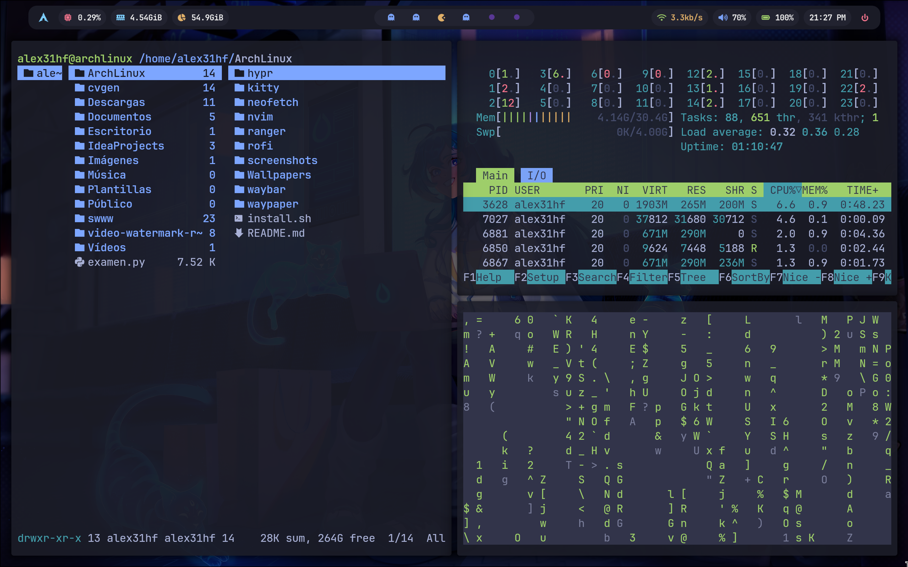
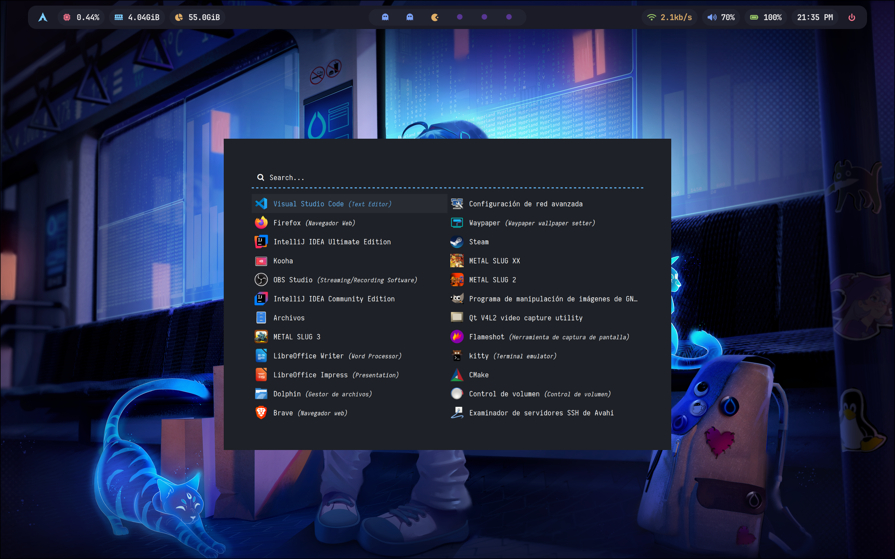

# 🐧 Arch Linux – Hyprland Rice

Este repositorio contiene mi entorno personal de **Arch Linux con Hyprland**, incluyendo mis configuraciones de Waybar, Rofi, Kitty, Neovim, Neofetch, Ranger y Waypaper.

Ideal si quieres usar, clonar o inspirarte en mi setup.

---

## 🌿 Entorno

- **Distro:** Arch Linux  
- **WM:** Hyprland (Wayland)  
- **Barra:** Waybar  
- **Launcher:** Rofi  
- **Terminal:** Kitty  
- **Editor:** Neovim  
- **File Manager:** Ranger  
- **Wallpapers:** Waypaper + `swww`  
- **System Info:** Neofetch  

---

## 📂 Imágenes de Escritorio de Arch Linux
<p align="center">
  
</p>
<p align="center">
  
</p>
<p align="center">
  
</p>
<p align="center">
  
</p>
<p align="center">
  
</p>
<p align="center">
  
</p>
<p align="center">
  
</p>

---

## 🚀 Instalación automática

Clonar y ejecutar:

```bash
git clone https://github.com/alexis3112hf/arch-config.git
cd arch-config
chmod +x install.sh
./install.sh
